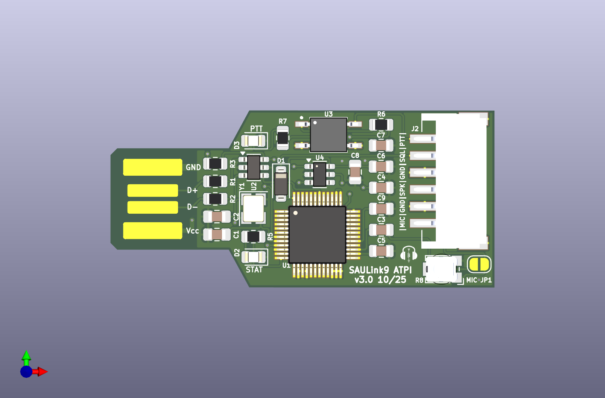
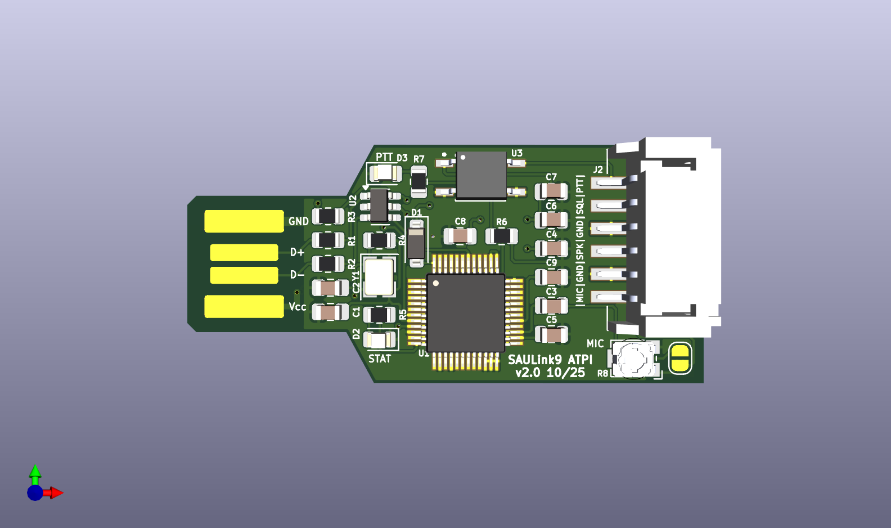
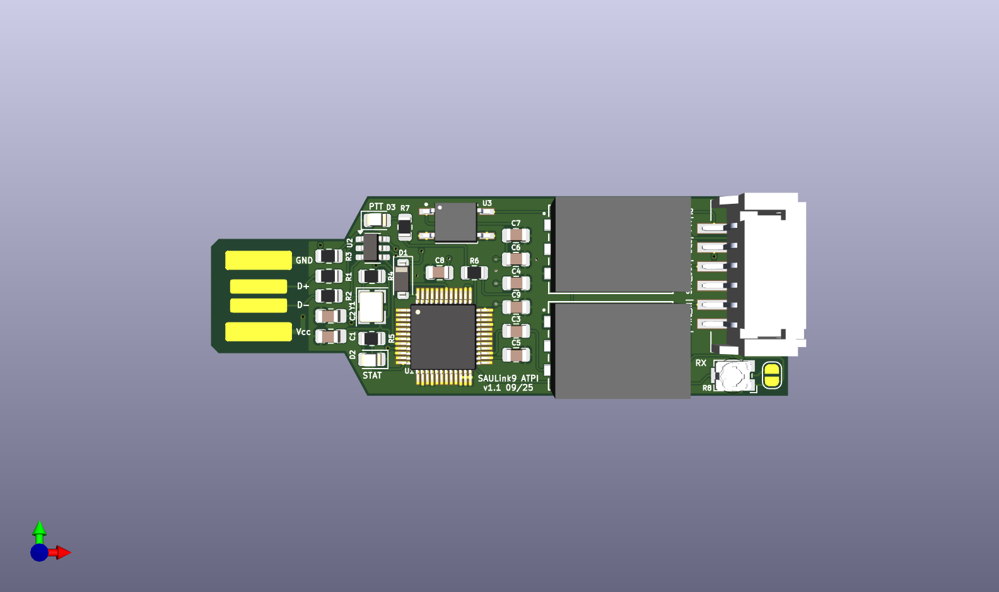

# SAULink9 ATPI

This project based on a CM108 soundchip provides an Audio and PTT (Push-to-Talk) interface to connect your analog radio.
Mainly it acts as a bridge between SAULink9 nodes and external radio hardware for any SVXLink network or any other applications.

### Features:

* Audio input/output

  * 100K potentiometer enables you to make fine tuned adjustments to the audio going in to the CM108 (GM340 etc)
    
  * Output audio levels are generally set in whichever software you're using with the ATPI

* PTT line control to GND thru optocoupler

* COS (Carrier on Squelch) input blocked by diode

* Easy integration/replacement into existing SAULink9 / SVXLink setups

* Customizing the device name with integrated EEPROM

* works with VARA

### Versions
v3.0: like v2.0 with EEPROM for Device name informations

v2.0: shorter version without 1:1 transformer

v1.1: like v1.0 footprint D1 changed to SOD-123

v1.0: with 1:1 transformer -> Audio level to low

### Note
all versions must be ordered in 1.2mm PCB thickness

all versions must be glued together with the empty board version, ordered as well with 1.2mm PCB thicknes, to achieve the USB connector thickness of around 2.5mm

v3.0

v2.0

v1.1

