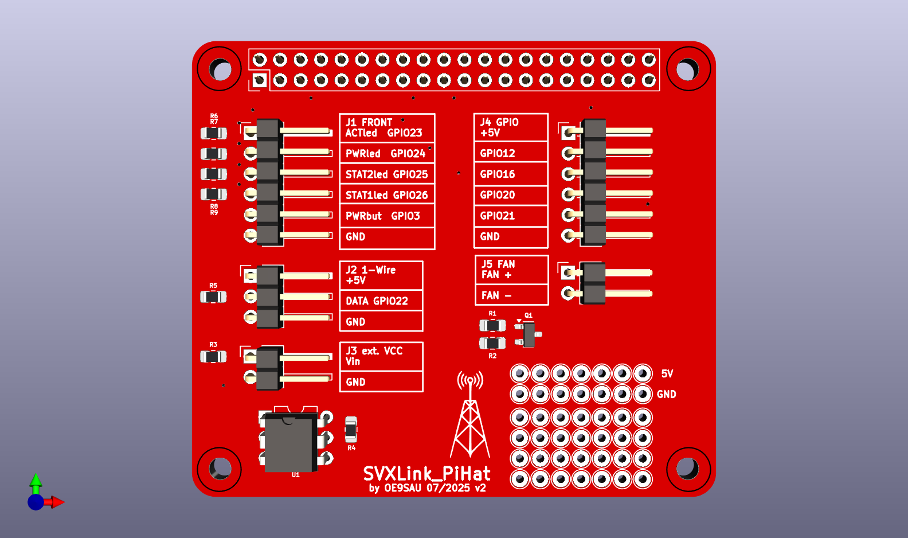
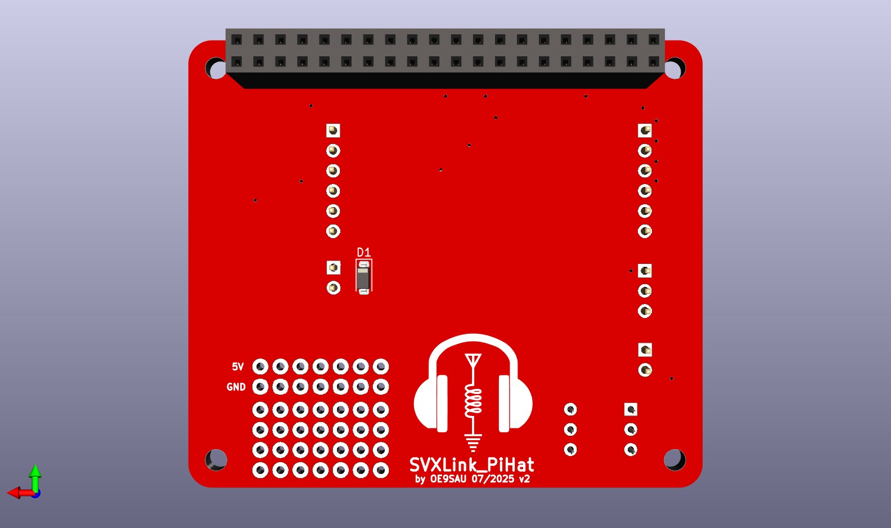

# SAULink9 RPiHat

PiHat for Rpi3B+, give space to some GPIOs and connection point to the SAULink9 front panel

## Highlights
  * configurable GPIOs for relays or other external circuits
  * FET fan control
  * External voltage detection with optocoupler
  * DIY space

