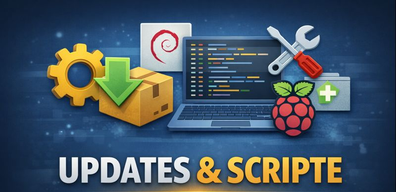

# update-system.sh

Führt ein normales Systemupdate (apt update + apt upgrade) durch und stellt anschließend sicher, 

dass Apache wieder mit PrivateTmp=false läuft. Was für die Funktion von DTMF und Co benötigt wird!

## Voraussetzung: 

SAULink9 mit Debian 12 "Bookworm"

```
cat /etc/os-release
````

# Funktionsweise:
1. Systemupdate ausführen
2. systemd-Override für apache2 prüfen/erstellen:
/etc/systemd/system/apache2.service.d/override.conf
3. systemd neu laden
4. Apache neu starten
5. Status von PrivateTmp anzeigen

# Verwendung:
Script von GitHub laden
````
sudo curl -fsSL https://raw.githubusercontent.com/OE9SAU/SAULink9/refs/heads/main/Scripte/update-system.sh \
  -o /usr/local/sbin/update-system.sh \
  && sudo chmod 755 /usr/local/sbin/update-system.sh
````
Script ausführen
````
sudo update-system.sh
````
# Ablage:
/usr/local/sbin/update-system.sh

